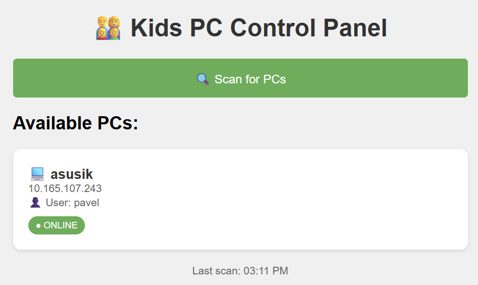
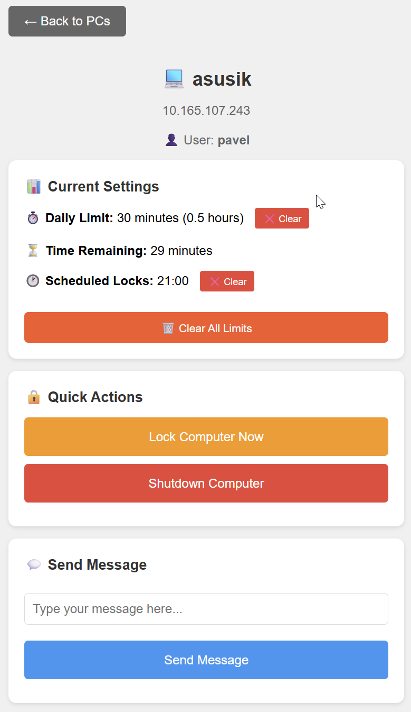
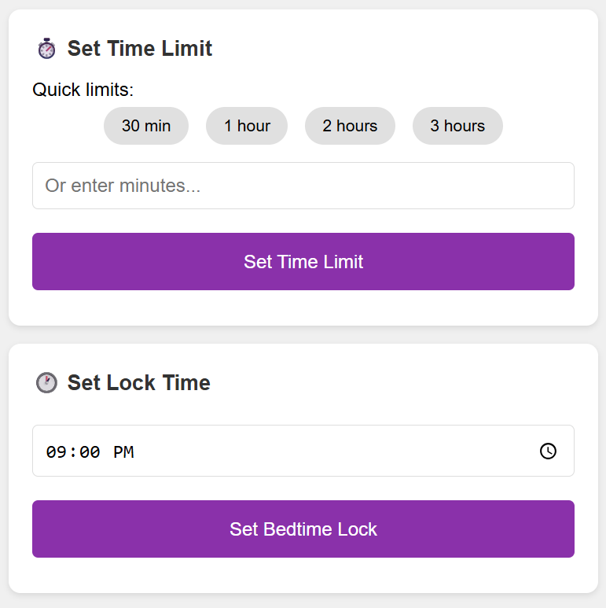

# Kid PC Monitor

DIY parental control system for parents who code. If you know what 'pip install' means, this is for you!


## 🎯 Features

- **📱 Control from your phone** - Web interface works on any device
- **🔒 Remote lock/unlock detection** - See if kids' PCs are locked
- **⏰ Scheduled bedtime locks** - Automatically lock at set times
- **⏱️ Daily usage limits** - Set maximum screen time
- **💬 Send messages** - Display warnings or reminders
- **🏠 Auto-discovery** - Finds all PCs on your network
- **⏰ Grace period warnings** - 15, 5, and 1-minute warnings before locks
- **💾 Persistent settings** - Limits survive PC restarts
- **👤 User-specific restrictions** - Monitor only specific Windows accounts
- **📊 Real-time status** - See current limits and time remaining

## 📸 Screenshots





## 🚀 Quick Start

## ⚠️ Technical Skills Required

This is NOT a one-click solution. You'll need to:
- Install Python
- Use a terminal / command prompt
- Understand IP addresses
- Open firewall ports where needed (Windows on kid PCs; on Linux parents, e.g. `ufw` or your distro's firewall)
- On kid PCs: set up a Windows scheduled task (the installer does this)

If these terms scare you, consider commercial alternatives like:
- Qustodio
- Net Nanny
- Windows Family Safety

### Prerequisites
- **Kid PCs:** Windows 10/11 (the monitoring agent uses Windows APIs)
- **Parent / admin machine:** Windows, Linux, or macOS with Python 3.7+ (runs the Flask web panel only)
- **Network:** Kid PCs must accept inbound TCP **9999** from the machine running the web panel (usually the same LAN; cross-subnet works if routed and allowed by firewalls). The web panel listens on TCP **5000** for your browser or phone.

Auto-discovery scans the `/24` subnet containing the parent machine's primary IPv4 address (see `scan_for_servers` in `src/web_panel.py`). If discovery misses a PC, you can still use it once the agent is reachable at its IP.

### Installation

There are two ways to set up Kid PC Monitor:

#### Option A: Separate Parent PC (Recommended)

Run the web panel on a separate PC (your own computer). More secure since kids can't access the admin interface.

1. **On each kid's PC:**
```bash
git clone https://github.com/rookie7799/kid-pc-monitor.git
cd kid-pc-monitor

# Run installer as administrator
python scripts/install.py
```

> **No `pip install` needed here.** The monitoring agent (`pc_control.py`) and
> the installer use only the Python standard library, so kid PCs just need
> Python itself. `requirements.txt` (Flask) is only for the machine that runs
> the web panel — see step 2.

> ⚠️ **IMPORTANT — enter the KID's account, not yours.** The installer must run
> elevated, so it is usually launched from a **parent/admin** account. But the
> monitor has to run inside the **kid's** session. When the installer asks for
> the *"Kid's Windows username"*, it shows the elevated (admin) account it
> detected as a hint — **if the kid logs in with a different account (the normal
> case), type that account instead.** Only accept the detected name if the
> account you are installing for is the very same one you are logged in as.
>
> The scheduled task is created to run as the account you type, triggered at
> **that** user's logon. Get this wrong and the task installs successfully but
> **never starts when the kid logs in, and clicking "Run" does nothing** — with
> no error and no log, which is very hard to diagnose. So double-check this one
> prompt. You can confirm it later in Task Scheduler → the task's **General** tab
> → *"When running the task, use the following user account"* should show the
> **kid's** account.

2. **On your PC (Windows or macOS; for Linux, see the Linux parent steps below):**

The web panel needs Flask. Best practice is to install it into an isolated
**virtual environment** rather than your system Python, so dependencies don't
clash with other projects:

```bash
git clone https://github.com/rookie7799/kid-pc-monitor.git
cd kid-pc-monitor

# Create and activate a virtual environment (best practice)
python -m venv .venv
.venv\Scripts\activate        # Windows (PowerShell or cmd)
# source .venv/bin/activate   # macOS / Linux

pip install -r requirements.txt

cd src
python web_panel.py

# Open in browser: http://YOUR-PC-IP:5000
```

> **Prefer conda?** Use a conda environment instead of `venv` — ready to
> copy‑paste:
> ```bash
> conda create -y -n kid-pc-monitor python=3.12
> conda activate kid-pc-monitor
> pip install -r requirements.txt
> ```

**Linux parent machine:** The web panel does not require `pywin32`; `requirements.txt` installs it only on Windows. From the repo root:

```bash
git clone https://github.com/rookie7799/kid-pc-monitor.git
cd kid-pc-monitor
python3 -m venv .venv
source .venv/bin/activate   # On Windows: .venv\Scripts\activate
pip install -r requirements.txt
cd src
python3 web_panel.py
```

Then open `http://YOUR-LINUX-IP:5000` from your phone or browser. Allow inbound TCP **5000** on the Linux host (example with UFW: `sudo ufw allow 5000/tcp`).

**systemd / service note:** `web_panel.py` writes `templates/` under the process **current working directory** when it is imported. If you run it from a unit file, set `WorkingDirectory=` to the directory you use for `cd` (for example the repo's `src` folder if you start the app from there).

**Install as a user service (survives reboot when user lingering is enabled):** from the repo root, after `pip install -r requirements.txt`:

```bash
chmod +x scripts/install_web_panel_linux.sh
./scripts/install_web_panel_linux.sh install   # writes ~/.config/systemd/user/kid-pc-monitor-web-panel.service
./scripts/install_web_panel_linux.sh status
# ./scripts/install_web_panel_linux.sh uninstall   # when you want it gone
```

Use `./scripts/install_web_panel_linux.sh cat-unit` to preview the unit. Override the interpreter with `PYTHON=/path/to/python3 ./scripts/install_web_panel_linux.sh install` if you do not use a repo-root `.venv`. For the service to start at boot **before anyone logs in graphically**, run once: `sudo loginctl enable-linger "$USER"`.

#### Option B: Single PC Setup

Run everything on the kid's PC and access the admin panel from your phone. Convenient if you don't have a separate PC always running.

1. **On the kid's PC (as administrator):**
```bash
git clone https://github.com/rookie7799/kid-pc-monitor.git
cd kid-pc-monitor
pip install -r requirements.txt

# Install both services
python scripts/install.py           # Installs pc_control
python scripts/install_web_panel.py # Installs web panel
```

> ⚠️ When `install.py` asks for the *"Kid's Windows username"*, enter the
> **standard account the child logs in with**, not the admin account you used to
> run the installer. See the boxed note under Option A for why this matters.

2. **On your phone:**
   - Open browser and go to `http://KIDS-PC-IP:5000`
   - Bookmark it for easy access

Both services run invisibly in the background using `pythonw.exe`.

**Note:** With this setup, a tech-savvy child could potentially discover the web panel at `localhost:5000`. Option A is more secure.

---

*Side note: if your kid is "good" with computers, consider copying the scripts somewhere less obvious.*

## 📖 Usage Guide

### Setting Up Daily Limits
1. Open the web interface on your phone
2. Click on a PC
3. View current settings in the "📊 Current Settings" section
4. Use quick buttons: "30 min", "1 hour", "2 hours"
5. Or set a custom time limit
6. Page auto-refreshes to show the new limit

### Setting Bedtime
1. Select a PC
2. Scroll to "Set Lock Time"
3. Choose bedtime (e.g., 9:00 PM)
4. PC will lock automatically at that time
5. See the scheduled lock in "Current Settings"

### Clearing/Removing Limits
1. View the "📊 Current Settings" section
2. Click the **❌ Clear** button next to any limit you want to remove
3. Or click **🗑️ Clear All Limits** to remove everything
4. Changes take effect immediately

### Emergency Unlock
While remote unlock isn't possible for security, you can:
- Clear the usage limit to grant unlimited time
- Clear scheduled locks to prevent automatic locking
- Send a message to request unlock
- Restart the PC (if no password)

## ⚙️ Configuration

### Custom PC Names
Edit `src/web_panel.py`:
```python
CUSTOM_PC_NAMES = {
    '192.168.1.105': 'Tommy\'s Laptop',
    '192.168.1.112': 'Sarah\'s Desktop',
}
```

### User-Specific Monitoring
Monitor only specific Windows user accounts. Edit `src/pc_control.py`:

```python
# Option 1: Monitor ONLY these specific users
MONITORED_USERS = ['Tommy', 'Sarah']  # Only these kids are restricted
EXEMPT_USERS = []

# Option 2: Monitor everyone EXCEPT these users
MONITORED_USERS = []
EXEMPT_USERS = ['pavel', 'Mom', 'Dad']  # Parents are exempt

# Option 3: Monitor ALL users (default)
MONITORED_USERS = []
EXEMPT_USERS = []
```

**Use Case:** If multiple family members share one PC, you can restrict only the children's accounts while leaving parent accounts unrestricted.

### Persistent State
Settings are automatically saved to `pc_control_state.json` including:
- Daily usage limits
- Scheduled lock times
- Start time for usage tracking

This means restrictions **survive PC restarts** - kids can't bypass by rebooting!


## 🔧 Troubleshooting

### Verify the agent is listening (port 9999)
> **The agent only starts after the kid logs in.** It runs inside the kid's
> desktop session, so right after installation — while you're still signed in as
> the admin — it is **not** running yet, and that's expected. Log in as the
> **kid's** account first (or, if that account is already signed in, run
> `schtasks /run /tn "KidPCMonitor"`).

Once logged in as the kid, confirm the agent is listening:

```cmd
netstat -an | findstr 9999
```

You should see a line like `TCP    0.0.0.0:9999    0.0.0.0:0    LISTENING`. If
nothing shows up, see the task-troubleshooting note below.

### "PC shows as Unknown"
- Add custom names in configuration
- Check Windows Firewall settings
- Ensure PCs are on same network

### "Can't connect from phone"
- Check firewall allows port 5000 (web panel host) and port 9999 (each kid PC running the agent)
- On Linux parents, ensure the host firewall allows inbound **5000/tcp** (e.g. `ufw allow 5000/tcp`)
- Use the web panel machine's IP address, not localhost
- Ensure `web_panel.py` is running

### "Lock status not updating"
- Restart pc_control.py
- Check if LogonUI.exe detection works
- See logs in console window

### "Task installed but the agent never runs (port 9999 not listening; clicking Run does nothing)"
- Almost always the **wrong user account**: the scheduled task was created for
  the admin/parent account used to run the installer, not the kid's account, so
  it never triggers at the kid's logon. Open Task Scheduler → the **KidPCMonitor**
  task → **General** tab and check *"When running the task, use the following
  user account"*. If it isn't the **kid's** account, re-run `python scripts/install.py`
  as administrator and enter the **kid's** username when prompted.
- It runs when you start it manually but not as a task: that confirms the above —
  manual runs use *your* logged-in session, the task uses the account it was
  created for.
- Check the agent's logs in the **`src` folder** (the task's working directory):
  `pc_control.log` (look for `Server started on port 9999`) and `pc_control.out.log`.

## 🛡️ Security Notes

- Only works on local network (not internet)
- No passwords stored
- Can't bypass Windows lock screen
- Kids can close if they have admin rights

## 🤝 Contributing

Parents and developers welcome! Please:
1. Fork the repository
2. Create a feature branch
3. Submit a pull request

### Recent Improvements (v2.0)
- ✅ Grace period warnings (15, 5, 1 minute before lock)
- ✅ Persistent state storage (settings survive restarts)
- ✅ User-specific restrictions (monitor only certain accounts)
- ✅ Fixed usage time calculation bug
- ✅ Improved error handling and logging
- ✅ Web UI shows current limits and time remaining
- ✅ Better resource management

### Ideas for Future Contributions
- Linux/macOS **agent** (kid-side monitoring; the web panel already runs on Linux/macOS/Windows)
- Mobile app
- Usage statistics/reports
- Reward system integration
- Application-specific time limits
- Authentication/password protection

## 📄 License

MIT License - feel free to modify for your family's needs!

## ❤️ Acknowledgments

Created by parents, for parents. Special thanks to all contributors who help make screen time management easier!

---

**Need Help?** Open an [issue](https://github.com/rookie7799/kid-pc-monitor/issues) or check our [FAQ](docs/FAQ.md)
